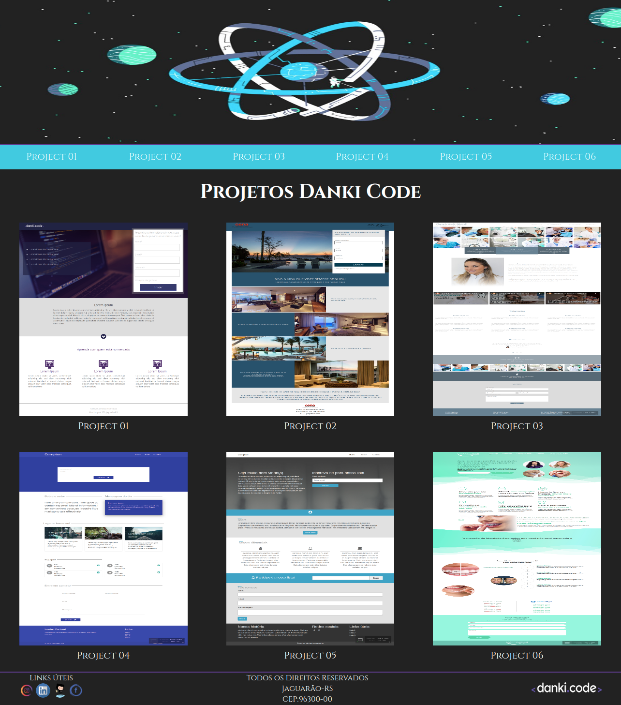

<h1>
  
</h1>

# Indice

- [Sobre](#-sobre)
- [Tecnologias](#-tecnologias-utilizadas)
- [Download](#-como-fazer-download-do-projeto)

## 📋 Sobre

O projeto é uma **Landing Page** que foi desenvolvida para redirecionar para os projetos criados no curso de Front-end da **Danki Code**.

---

## 🚀 Tecnologias utilizadas

Os projetos foram desenvolvidos utilizando as seguintes tecnologias.

- [Html](https://html.com/)
- [CSS](https://www.w3.org/Style/CSS/Overview.en.html)
- [JavaScript](https://www.javascript.com/)
- [JQuery](https://jquery.com/)
- [Materialize](https://materializecss.com/)
- [Bootstrap](https://getbootstrap.com/)

---

## ⬇️ Como fazer download do projeto.

```bash
  # Clonar o repositório
  $ git clone http://github.com/Ferreira94/DankiCode
  # Entrar no diretório
  $ cd DankiCode
```

Após clonar o repositório e entrar no diretório do projeto é necessário abrir o arquivo **index.html**.

---
Desenvolvido por Luciano Ferreira.